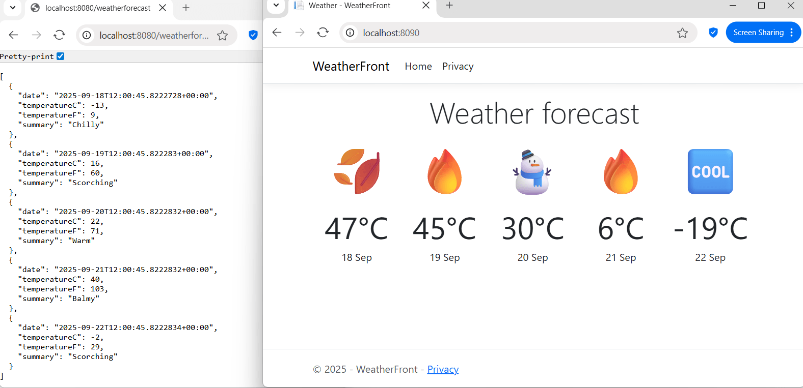
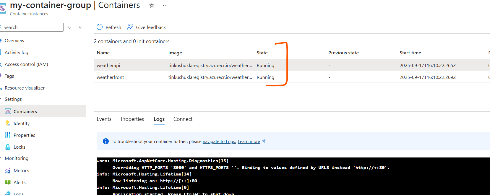
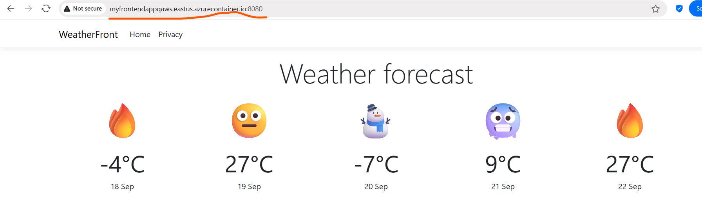

# Az-204-weather-container-demo
Both the containers are exposing port : 8080 , make sure you are mapping port 8080 whereever using these images.
# How this application look like   



## Run the Front End Application Container

```bash
docker run -d -p 8090:8080 \
  -e ASPNETCORE_ENVIRONMENT=Development \
  -e DOTNET_USE_POLLING_FILE_WATCHER=1 \
  -e DOTNET_RUNNING_IN_CONTAINER=true \
  -e DOTNET_HOST_PATH=/usr/share/dotnet/dotnet \
  -e "WeatherUrl=http://weatherapi-container:8080/weatherforecast" \
  --name weatherfronapp-container \
  weatherfront:1.0
```

You can use these two docker images for various scenarios  
  


# 1. If you are running this in WSL environment then use Docker compose

## Docker Compose file , if you want to Build the docker image and Run the containr

Run the Command  : 

```bash
docker-compose up --Build
```
Below is Docker  Compose yaml File <a href="docker-compose.yml" target="_blank">docker-compose.yml</a>

This will create a Docker Network named **weather-net**

```bash
version: '3.9'

services:
  weatherapi:
    build:
      context: ./wetherforecastapi   # path where Dockerfile for weatherapi exists
      dockerfile: Dockerfile
    image: weatherapi:1.0
    container_name: weatherapi-container
    ports:
      - "8080:8080"
    environment:
      - ASPNETCORE_URLS=http://+:8080
    networks:
      - weather-net

  weatherfront:
    build:
      context: ./WeatherFront   # path where Dockerfile for weatherfront exists
      dockerfile: Dockerfile
    image: weatherfront:1.0
    container_name: weatherfront-container
    ports:
      - "8090:8080"
    environment:
      - DOTNET_USE_POLLING_FILE_WATCHER=1
      - DOTNET_RUNNING_IN_CONTAINER=true
      - DOTNET_HOST_PATH=/usr/share/dotnet/dotnet
      - WeatherUrl=http://weatherapi-container:8080/weatherforecast
    depends_on:
      - weatherapi
    networks:
      - weather-net

networks:
  weather-net:
    driver: bridge
```


## If you want to Run the container without Building the images 

You can also specify the file name of yaml.

```bash
docker-compose -f docker-compose-withoutBuild.yml up -d
```
Content of the file <a href="docker-compose-withoutBuild.yml" target="_blank">docker-compose-withoutBuild.yml</a>

```bash
version: '3.9'

services:
  weatherapi:
    image: weatherapi:1.0
    container_name: weatherapi-container
    ports:
      - "8080:8080"
    environment:
      - ASPNETCORE_URLS=http://+:8080
    networks:
      - weather-net

  weatherfront:
    image: weatherfront:1.0
    container_name: weatherfront-container
    ports:
      - "8090:8080"
    environment:
      - DOTNET_USE_POLLING_FILE_WATCHER=1
      - DOTNET_RUNNING_IN_CONTAINER=true
      - DOTNET_HOST_PATH=/usr/share/dotnet/dotnet
      - WeatherUrl=http://weatherapi-container:8080/weatherforecast
    depends_on:
      - weatherapi
    networks:
      - weather-net

networks:
  weather-net:
    driver: bridge
```

# 2. Building with ACR Build

## Build Docker images using Azure ACR Task

```bash
az acr build --registry tinkushuklaregistry --image tinkuhelloacrtasks:v1 .
```

# 3.Deploying both as conatienr group in ACI

Make sure that you have created the yaml file , In the yaml file <a href="ACI-group.yml" target="_blank">ACI-group.yml</a> Backend API is refrenced as  LocalHost url instead of backend container name.

```bash
apiVersion: 2019-12-01
location: eastus
name: my-container-group
properties:
  containers:
  - name: weatherapi
    properties:
      image: tinkushuklaregistry.azurecr.io/weather/weatherapi:1.0
      resources:
        requests:
          cpu: 1
          memoryInGb: 1
      # internal ports only, do NOT expose in YAML
      environmentVariables:
      - name: ASPNETCORE_URLS
        value: "http://+:80"
      - name: ASPNETCORE_ENVIRONMENT
        value: Development

  - name: weatherfront
    properties:
      image: tinkushuklaregistry.azurecr.io/weather/weatherfront:1.0
      resources:
        requests:
          cpu: 1
          memoryInGb: 1

      ports:
      - port: 8080  # match ipAddress port    
      environmentVariables:
      - name: WeatherUrl
        value: http://localhost:80/weatherforecast  # use Local host instead of container name
      - name: ASPNETCORE_URLS
        value: "http://+:8080;http://+:8081"
      - name: ASPNETCORE_ENVIRONMENT
        value: Development
      
  osType: Linux
  ipAddress:
    type: Public
    dnsNameLabel: myfrontendappqaws
    ports:
    - protocol: tcp
      port: 8080  # expose frontend port 8080 externally

  restartPolicy: Never

  imageRegistryCredentials:
  - server: tinkushuklaregistry.azurecr.io
    username: tinkushuklaregistry
    password: <your ACR credentials>
```

You can deploy this yaml file using below command

```bash
az container create --resource-group myResourceGroup --file ACI-group.yml
```

you can verify that both the container sgould be in Running state  
  


you can access the running frontend container from the group at http://myfrontendappqaws.eastus.azurecontainer.io:8080/



# 4. Deploy Container in Azure Web App

# 5. Deploy container as Azure Container Apps

# 6. Deploy to Azure Kubernetes Cluster


